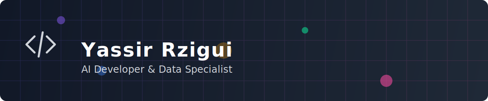

#  Yassir Rzigui

  

  

##  About Me

Full Stack Developer and AI Specialist with expertise in language model training, data quality, and backend development. Multilingual professional proficient in Arabic dialects, French, and English.

-  **AI & ML**: Training language models using RLHF, machine learning linguistics, model validation
-  **Backend Development**: API design, database management, quality systems
-  **Languages**: Arabic (Native - multiple dialects), French (Professional), English (Professional)
-  **Specialization**: AI data annotation, transcription, and quality assurance

##  Skills & Technologies

  
  
  
  
  
  
  
  
  

###  AI & Machine Learning
- Language Model Training
- RLHF Techniques
- AI Data Annotation
- Machine Learning Linguistics
- Model Validation & Quality Control

###  Development
- Backend Development
- API Design
- Database Management
- Quality Assurance
- System Architecture

##  Multilingual AI & Linguistic Capabilities

<table>
<tr>
<td>

### Languages
- Arabic (Native)
  - Maghrebi
  - Levantine
  - Gulf
  - Egyptian
  - Saudi
  - UAE
  - Lebanese
- French (Professional)
- English (Professional)

</td>
<td>

### AI & NLP Specializations
- Cross-cultural AI validation
- Dialectal variation analysis
- Linguistic annotation and validation
- Language-specific model tuning
- AI bias detection and mitigation
- Speech recognition quality control
- Multilingual data curation

</td>
</tr>
</table>

##  Professional Experience

###  AI Language Model Trainer | Outlier
*Dec 2023 - Present*
- Contributing to next-generation LLM development using RLHF techniques
- Performing sophisticated model training and fine-tuning tasks
- Evaluating and improving AI model responses and behaviors

###  ML Linguistics Specialist | RWS
*Dec 2023 - Present*
- Executing language-specific machine learning tasks
- Conducting linguistic analysis for ML model improvement
- Providing cultural and linguistic validation for ML models

###  AI Data Quality Specialist | Sigma AI
*Dec 2023 - Present*
- Implementing quality control protocols for data annotation
- Validating AI training datasets for accuracy and consistency
- Contributing to AI model improvement through quality data preparation

###  Technical Quality & AI Specialist | Multiple Platforms
*Jan 2019 - Present*
- Developed quality validation frameworks for AI training data
- Led data collection and annotation projects for ML model optimization
- Achieved consistent 95%+ quality scores across platforms

##  Certifications & Education

- **Digital AI Architect: Full Stack and Intelligent Systems** - Digital Maroc School (2025)
- **ProDev Backend Developer** - ALX (2025)
- **Backend Development** - ALX (2025) [Certificate](https://intranet.alxswe.com/certificates/FL5C8xr6hB)
- **Founder Academy** - ALX (2024)
- **Professional Foundations** - ALX (2024) [Certificate](https://intranet.alxswe.com/certificates/xn7B9heyPf)
- **AI Career Essentials** - ALX (2024) [Certificate](https://intranet.alxswe.com/certificates/56nSLFE3Z7)
- **Food Science** - Faculty Polydisciplinaire, Taroudant, Morocco (2014-2017)

##  GitHub Stats

  
  

  

##  Featured Projects

### [Travel App](https://github.com/yazzy01/alx_travel_app)
A travel application built with Python, focusing on backend functionality and API integration.

### [Backend GraphQL CRM](https://github.com/yazzy01/alx-backend-graphql_crm)
A customer relationship management system built with GraphQL and Python.

### [DevOps & System Engineering](https://github.com/yazzy01/alx-system_engineering-devops)
A collection of DevOps and system engineering projects using Shell, Python, Puppet, and more.

##  Contribution Graph

  <picture>
    <source media="(prefers-color-scheme: dark)" srcset="https://raw.githubusercontent.com/yazzy01/yazzy01/output/github-contribution-grid-snake-dark.svg" />
    <source media="(prefers-color-scheme: light)" srcset="https://raw.githubusercontent.com/yazzy01/yazzy01/output/github-contribution-grid-snake.svg" />
    
  <a href="https://github.com/yazzy01">

##  Currently Learning

- Advanced LLM fine-tuning techniques
  </a>
- Multimodal AI systems and integration

##  Get In Touch

- LinkedIn: [Yassir Rzigui](https://www.linkedin.com/in/yassir-rzigui/)
- Email: [rziguiyassir@gmail.com](mailto:rziguiyassir@gmail.com)
- Phone: +212 634 814 854

---

  

  <em>Building the future of AI and language technologies</em>

