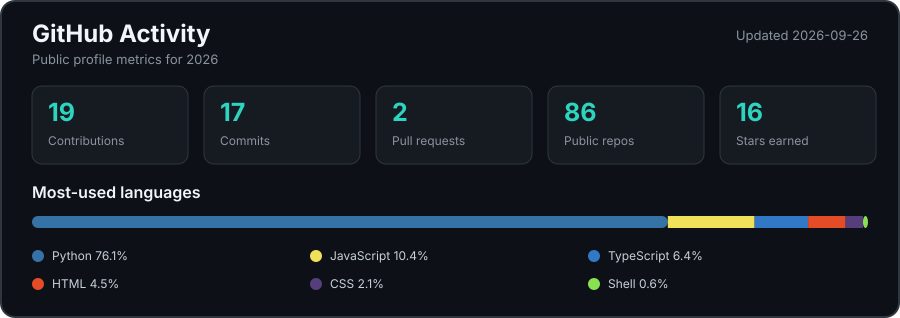

# Hi, I'm Yassir Rzigui 👋

---

## About Me

I am an **AI Data Specialist and Full-Stack Engineer** with 5+ years of experience spanning data annotation, data quality, multilingual data curation, LLM evaluation, RLHF, SFT, AI safety, and production software engineering.

I turn complex evaluation guidelines into accurate datasets, benchmark signals, and automated quality workflows. I also build AI-integrated products and data pipelines with Python, SQL, PostgreSQL, React, Next.js, Node.js, Docker, and CI/CD.

- 🔐 **Current focus:** AI safety, red teaming, agentic trajectory evaluation, and software-engineering benchmarks
- 🤖 **AI data:** RLHF, SFT, prompt evaluation, rubric design, annotation QA, and benchmark development
- 🌍 **Languages:** Arabic (native), French (native), and English (professional)
- 📍 **Location:** Morocco - working remotely worldwide

> **Currently:** AI Safety, Data, and SWE Evaluation Specialist at **Mercor** (contract), and Full-Stack and AI Engineer at **Sigma AI**.

---

## Core Expertise

| AI Data and Evaluation | Engineering and Automation |
|---|---|
| Data annotation, validation, and quality assurance | Python, SQL, PostgreSQL, and data analysis |
| RLHF, SFT, prompt writing, and LLM evaluation | Data pipelines and automated QA workflows |
| AI red teaming and model-safety evaluation | React, Next.js, TypeScript, and Node.js |
| Multilingual curation and linguistic QA | Docker, AWS, GitHub Actions, and CI/CD |
| Benchmark development and technical rubric design | FastAPI, LangChain, MongoDB, and semantic search |

---

## Experience

| Role | Organization | Period | Selected impact |
|---|---|---|---|
| **AI Safety, Data, and SWE Evaluation Specialist** | Mercor | 2025 - Present | Produce structured evaluation data for RLHF/SFT workflows; perform multilingual red teaming, safety testing, benchmark writing, CLI comparison, agentic trajectory review, and cybersecurity-focused SWE evaluation. |
| **Full-Stack and AI Engineer** | Sigma AI | Dec 2023 - Present | Build AI-integrated dashboards, annotation monitoring tools, and data-quality workflows; automated QA checks reduced manual effort by 40%. |
| **AI Workflow Engineer and Data Annotator** | Outlier | Feb 2024 - Jul 2025 | Supported multilingual RLHF-aligned evaluation and reviewed 500+ prompts and records daily; Python automation saved 15+ manual hours per week. |
| **Software Engineer, AI and Automation** | Contract AI | 2024 - 2025 | Built legal-document automation with Next.js, Node.js, PostgreSQL, AI APIs, structured extraction, and hallucination checks. |
| **Freelance Full-Stack Developer** | Independent | Apr 2021 - Present | Delivered 25+ web and SaaS applications across health, legal tech, e-commerce, and education. |
| **AI Data Quality Specialist and MT Evaluator** | RWS Group | Nov 2023 - Jan 2025 | Evaluated Arabic, French, and English datasets and machine-translation output through linguistic QA, semantic validation, and error analysis. |
| **Remote AI Data Annotator** | TELUS, UHRS, Clickworker, Appen/CrowdGen | Jan 2019 - Mar 2025 | Performed large-scale labeling, relevance classification, speech evaluation, and content-quality review across multilingual datasets. |

---

## Selected Projects

| Project | Description | Stack / Link |
|---|---|---|
| **TrendFlow SaaS** | Micro-trend forecasting platform using embeddings and real-time data pipelines. | FastAPI, embeddings, data pipelines |
| **Profile Builder** | Automated portfolio generation with multi-step reasoning and structured profile extraction. | [Live demo](https://auto-profil-v3.vercel.app/) |
| **CineDiscover** | AI movie recommendation system using model-powered reasoning and structured metadata. | [Live demo](https://cinediscover.vercel.app/) |

---

## Technology Stack

---

## Education and Training

- **Ph.D., Computer Science - Machine Learning and Natural Language Processing**, UM6P (2019 - 2022)
- **M.S., Computer Science - Artificial Intelligence**, UM6P (2017 - 2019)
- **Bachelor's Degree, Mathematics and Computer Science**, Universite Ibn Zohr (2014 - 2017)
- **Digital AI Architect - Full-Stack and Intelligent Systems**, Digital France School (2025)
- **Backend Software Engineering and AI Foundations**, ALX Africa (2024 - 2025)

### Certifications

- Full-Stack Developer and AI Data Specialist - micro1 (2025)
- ProDev Backend Developer - ALX (2025)
- Backend Development Certification - ALX (2025)

---

## GitHub Activity

  

  <picture>
    <source media="(prefers-color-scheme: dark)" srcset="https://raw.githubusercontent.com/yazzy01/yazzy01/output/github-contribution-grid-snake-dark.svg"/>
    <source media="(prefers-color-scheme: light)" srcset="https://raw.githubusercontent.com/yazzy01/yazzy01/output/github-contribution-grid-snake.svg"/>
    
  </picture>

---

## Let's Connect

I am open to remote AI data, LLM evaluation, AI safety, and full-stack engineering opportunities.

